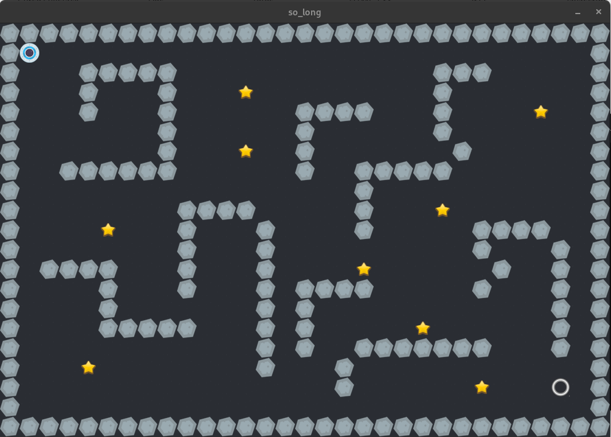

# 🕹️ so_long

> A 2D game developed in C using the **MiniLibX** graphical library as part of the **42 School** curriculum.

**so_long** is a small 2D game where the player must navigate through a map, collect all collectibles, and reach the exit using the minimum possible number of movements.

This project focuses on graphics programming, event handling, memory management, map validation, and fundamental game logic in C.

---

## 📚 About the Project

The main objective of `so_long` is to create a simple 2D game using the **MiniLibX** library.

The map is represented by a `.ber` file containing different types of tiles:

* 🧱 `1` — Wall
* 🟩 `0` — Empty space
* 🧍 `P` — Player
* 💎 `C` — Collectible
* 🚪 `E` — Exit

The player must collect **all collectibles** before being able to finish the game by reaching the exit.

---

## 🎮 Gameplay

The player can move using:

| Key       | Action        |
| --------- | ------------- |
| `W` / `↑` | Move up       |
| `A` / `←` | Move left     |
| `S` / `↓` | Move down     |
| `D` / `→` | Move right    |
| `ESC`     | Exit the game |

Every valid movement is counted and displayed in the terminal.

---

## 🗺️ Map Rules

A valid map must:

* Have the `.ber` extension.
* Be rectangular.
* Be surrounded by walls.
* Contain exactly **one player** (`P`).
* Contain exactly **one exit** (`E`).
* Contain at least **one collectible** (`C`).
* Contain only valid characters.
* Have a valid path allowing the player to collect every collectible and reach the exit.

Example:

```text
1111111111
1000000001
1011101001
100C000001
1000111001
1P000000E1
1111111111
```

---

## 🧠 Main Concepts

This project was an opportunity to practice several important programming concepts:

### Graphics

Using **MiniLibX** to:

* Create a graphical window.
* Load and display images.
* Render the map.
* Handle keyboard events.
* Handle window events.

### Map Parsing

The program reads the `.ber` file and converts it into an internal representation that can be used by the game.

### Map Validation

Before starting the game, the map is checked for:

* Valid characters.
* Correct number of players and exits.
* Presence of collectibles.
* Rectangular structure.
* Closed walls.
* A valid path.

### Flood Fill

A **Flood Fill** algorithm is used to verify whether all collectibles and the exit are reachable from the player's starting position.

Conceptually:

```text
Player
  │
  ▼
Flood Fill
  │
  ├── Collectibles reachable? ✓
  │
  └── Exit reachable? ✓
```

### Memory Management

Since the project is written in C, memory must be carefully managed.

The project includes cleanup for:

* Maps.
* Strings.
* Images.
* Window resources.
* Game structures.

---

## 🛠️ Technologies

* **C**
* **MiniLibX**
* **Makefile**
* **Linux**
* **Git / GitHub**

---

## 📁 Project Structure

```text
so_long/
│
├── Makefile
├── README.md
│
├── includes/
│   └── so_long.h
│
├── src/
│   ├── main.c
│   ├── map/
│   ├── parsing/
│   ├── rendering/
│   ├── player/
│   └── utils/
│
├── textures/
│   ├── wall.xpm
│   ├── floor.xpm
│   ├── player.xpm
│   ├── collectible.xpm
│   └── exit.xpm
│
└── maps/
    ├── valid/
    └── invalid/
```

> The exact structure may vary depending on the organization of the implementation.

---

## ⚙️ Installation

Clone the repository:

```bash
git@github.com:ArilsonDjalma26/so_long.git
cd so_long
```

Compile the project:

```bash
make
```

---

## ▶️ Running the Game

Run the game by providing a `.ber` map:

```bash
./so_long maps/example.ber
```

Example:

```bash
./so_long maps/map.ber
```

---

## 🧹 Makefile Commands

Compile:

```bash
make
```

Remove object files:

```bash
make clean
```

Remove object files and the executable:

```bash
make fclean
```

Recompile everything:

```bash
make re
```

---

## 🎮 Gameplay


```

---

## 🚀 What I Learned

Through this project, I improved my understanding of:

* C programming.
* File parsing.
* 2D arrays and map representation.
* Algorithms such as Flood Fill.
* Event-driven programming.
* Graphical programming with MiniLibX.
* Keyboard and window events.
* Memory allocation and deallocation.
* Debugging with tools such as Valgrind.
* Building projects using Makefiles.
* Organizing a larger C project into multiple modules.

---

## 🔍 Error Handling

The program handles invalid input and invalid maps by displaying an error message and exiting safely.

Example:

```text
Error
```

The goal is not only to make the game work, but also to ensure that invalid maps and resources are handled correctly without memory leaks.

---

## 🎯 42 School

This project is part of the **42 School** Common Core.

The project helped reinforce the transition from purely terminal-based programs to interactive graphical applications while maintaining the strict requirements of the 42 curriculum.

---

## 👨‍💻 Author

**Arilson Albano**

42 Luanda — Student Developer

---

⭐ If you find this project interesting, feel free to explore the source code and follow my progress through the 42 curriculum.
